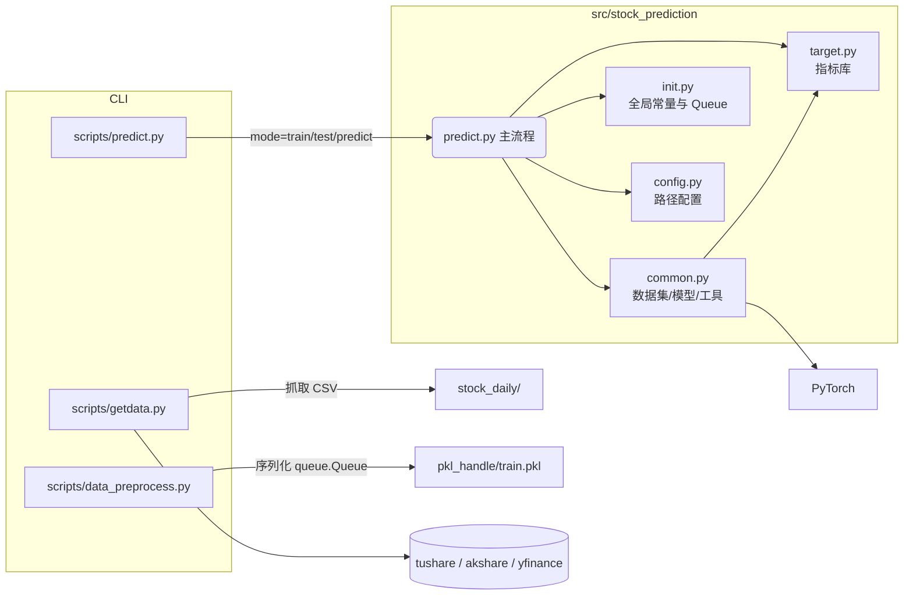

# 架构总览

项目采用“脚本入口 + 包内核心模块”的分层结构，数据流大致如下：

### 模块说明

- **scripts/**：命令行入口，负责调整 `sys.path` 并调用包内实现。当前脚本仍需修复以适配新的 `main()` 形式。
- **predict.py**：解析参数并调度训练、测试、预测流程，直接依赖 `init.py` 中的全局状态与队列。
- **common.py**：集中定义数据集、模型结构（LSTM/Transformer/CNNLSTM）、技术指标辅助函数、绘图、模型保存等功能，是代码体量最大的文件。
- **init.py**：存放训练常量（批大小、迭代次数、`device` 等）以及跨模块共享的 `queue.Queue` 实例。
- **config.py**：提供目录路径的集中管理，创建 `stock_daily/`、`pkl_handle/`、`models/` 等目录。
- **target.py**：技术指标算法集合，供特征加工或策略评估使用。
- **data_preprocess.py / getdata.py**：通过全局队列与 `dill` 序列化提供数据准备流程。

更多系统性分析及风险评估请参考 `docs/project_analysis.md`。
