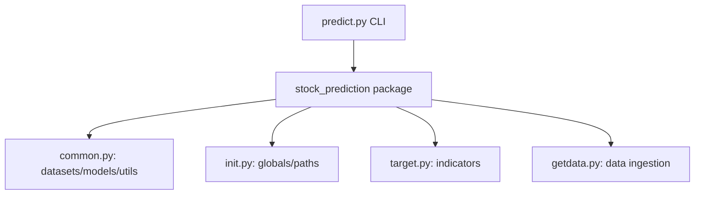

# 架构

```mermaid
flowchart TD
    A[predict.py CLI] --> B[stock_prediction package]
    B --> C[common.py: datasets/models/utils]
    B --> D[init.py: globals/paths]
    B --> E[target.py: indicators]
    B --> F[getdata.py: data ingestion]
```
