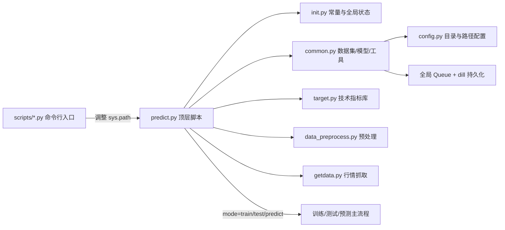

# 项目系统分析报告

## 1. 项目概览

本仓库实现了一个以深度学习为核心的股票预测原型，核心代码位于 `src/stock_prediction/` 下。项目通过命令行脚本运行训练、测试与预测流程，使用 `pandas`/`numpy` 进行数据处理，`torch` 训练多种模型（LSTM、Transformer、CNN-LSTM），并依赖 `queue.Queue` 管理跨线程/进程的数据缓冲。整体结构如下：

核心运行路径为：

1. 通过 `scripts/getdata.py` 抓取行情并写入 `stock_daily/`。
2. 使用 `scripts/data_preprocess.py` 聚合日线数据到 `pkl_handle/train.pkl`，内部以 `queue.Queue` 序列化。
3. `scripts/predict.py`（或直接执行 `src/stock_prediction/predict.py`）根据命令行参数选择训练/测试/预测，读取 `train.pkl` 中的队列数据，构造 `torch.utils.data.Dataset`，然后驱动模型训练与评估。

项目包含的主要模块与职责如下表所示：

| 模块 | 主要职责 | 备注 |
| ---- | -------- | ---- |
| `config.py` | 统一目录配置、自动创建输出目录 | 缺乏 `.env` / 动态配置支持 |
| `init.py` | 定义全局常量（训练参数、路径、队列实例、`device` 等） | 全局状态较多，难以单测 |
| `common.py` | 数据集实现、模型结构、训练辅助函数、队列复制、绘图等 | 职责过多，包含 BERT、CNNLSTM 等尚未集成的代码 |
| `predict.py` | 解析参数与主流程（`train`、`test`、`predict`）、数据加载、训练循环、模型保存 | 模块加载即解析参数，无法安全被导入 |
| `getdata.py` | 基于 `tushare` / `akshare` / `yfinance` 抓取行情 | 嵌套线程、无速率控制 |
| `data_preprocess.py` | 将 CSV 数据批量写入 `queue.Queue` 再持久化为 PKL | 依赖全局队列，序列化格式脆弱 |
| `target.py` | 技术指标计算函数库 | 供可选策略或特征工程使用 |
| `utils.py` | 日志写入、JSON/CSV 转换等工具 | 功能与日志体系尚未统一 |

## 2. 当前问题与风险

下列问题按严重程度（高/中/低）列出：

1. **高**：`src/stock_prediction/predict.py` 在模块顶层执行 `parser.parse_args()`，导致任意导入都会解析调用者的命令行参数。运行 `pytest` 时即触发 `SystemExit: unrecognized arguments: -q`（`tests/test_integration.py`）。这使得编程式调用、单元测试、其他脚本复用全部失败。  
   - *影响*：阻断自动化测试与后续服务化改造。

2. **高**：`scripts/predict.py` 期望 `stock_prediction.predict.main` 函数，但实际不存在 `main()`。当前脚本只会因为 `ImportError` 停止（或隐式触发问题 1）。命令行入口名义上存在，实际上不可用。  
   - *影响*：`make run-train` 等命令无法执行，README/文档与事实不符。

3. **高**：训练流程严重依赖 `init.py` 中的全局变量（模型、优化器、损失、队列、进度条状态等），函数签名缺乏参数化，训练循环内存在大量外部状态读写。并行训练、多模型共存或单元测试都非常困难。  
   - *影响*：可维护性差，修改任意子模块都可能引入隐蔽副作用。

4. **高**：数据依赖 `Queue` + `dill` 序列化。Python 3.13 对 `queue.Queue` 新增 `is_shutdown` 成员，旧 pickle 文件缺失该属性即抛出 `AttributeError`。虽然已新增 `ensure_queue_compatibility()` 进行兜底，但整体流水线仍高度脆弱（文件损坏即需要重新抓取/预处理）。  
   - *影响*：环境升级或换机时经常遇到不可预期的运行时错误。

5. **中**：`GradScaler('cuda')` 在 CPU 环境下仍被初始化（`src/stock_prediction/predict.py` 第 611 行附近），可能导致 `ValueError: cuda is not available`。虽然默认检测到 CUDA 时才走 AMP，但缩放器创建逻辑与设备判定未完全解耦。  
   - *影响*：在仅 CPU 环境运行 `--cpu 1` 时可能直接报错。

6. **中**：`common.py` 混杂模型定义、指标计算、绘图、线程工具等多种职责，文件接近 1,000 行。缺乏清晰的模块边界，后续功能拓展、测试或替换某个模型都会牵一发而动全身。  
   - *影响*：开发效率低，代码阅读与审查成本高。

7. **中**：外部行情抓取（`getdata.py`）未做速率限制、重试、异常分级；API 选择通过全局变量控制，缺乏配置文件。面对 API 限流或网络波动时，只能依赖手工排查日志。  
   - *影响*：数据拉取过程不稳定，难以自动化运行。

8. **低**：`docs/`、`README.md`、`CHANGELOG.md`、`agent_report.md` 均滞后于当前实际状态（例如仍声称已有 20+ 测试、`scripts/predict.py` 可用等），与真实情况不一致。  
   - *影响*：新成员或后续维护者难以快速了解现状。

9. **低**：BERT/NLP 相关代码段（`common.py` 内）尚未接入任何流程，缺少清理或独立封装，影响构建时间且增加依赖。  
   - *影响*：打包体积与依赖复杂度上升。

## 3. 解决方案与权衡

| 问题编号 | 建议方案 | 优点 | 注意事项 |
| -------- | -------- | ---- | -------- |
| 1 | 将 `argparse` 放入 `def main(argv=None)`，顶层仅调用 `if __name__ == "__main__": main()`；为测试提供独立入口函数 | 解除导入副作用，可安全单测与复用 | 需同步更新脚本与文档 |
| 2 | 在 `src/stock_prediction/predict.py` 暴露 `main()` 或调整 `scripts/predict.py` 直接运行 `stock_prediction.predict` 的 `run()` | 恢复命令行脚本可用性 | 同步 Makefile/README |
| 3 | 拆分全局状态：构建 `Config`、`Trainer`、`DataModule` 等类，将队列、模型、优化器、scheduler 变为实例属性 | 明确边界，支持多实例与单元测试 | 调整跨度大，需要分阶段迁移 |
| 4 | 使用标准化数据格式替代 `queue.Queue` pickle，例如 Parquet/Arrow 或自定义 JSONL；或为 pickle 增加版本头与升级脚本 | 减少版本耦合，提高可追溯性 | 需设计迁移策略，兼容历史数据 |
| 5 | 根据 `device.type` 构建 `GradScaler`，仅在 CUDA 可用时启用 AMP；CPU 分支使用纯浮点训练 | 避免 CPU 环境报错 | 兼容 Torch <2.0 的接口差异 |
| 6 | 拆分 `common.py`：按功能划分为 `datasets.py`、`models/`、`metrics.py`、`visualization.py` 等 | 文件职责清晰，后续重构成本低 | 需要完善导入路径与测试 |
| 7 | 为 `getdata.py` 和预处理加入 retry/backoff、限速、超时配置，并写入可观测日志 | 自动化更稳定，可定位故障 | 需要引入 logging 与配置管理 |
| 8 | 持续维护文档与 CHANGELOG，建立“变更即更新”流程（可通过 PR 模板或 pre-commit 检查） | 降低口头传达成本 | 需要团队协作配合 |
| 9 | 将 NLP 相关代码移出核心运行路径（独立子包或 `legacy/`），并按需加载所需依赖 | 减少资源消耗，清晰代码界限 | 注意向后兼容性 |

## 4. 后续开发方向

1. **基础重构优先级**
   - 先解决模块导入副作用与入口函数缺失问题，恢复测试/脚本可用性。
   - 引入模块化配置（建议使用 `pydantic` 或 `dynaconf`）和 `.env` 模板，配合 `Config` 替换硬编码常量。
   - 拆分 `common.py`，建立 `src/stock_prediction/models/`、`src/stock_prediction/data/` 等子包。

2. **数据与训练改进**
   - 重新设计数据缓存格式，替换队列 + pickle；引入校验（checksum/版本号）。
   - 梳理训练循环，封装为 `Trainer` 类，支持回调（checkpoint、early stopping、评估）。
   - 引入配置化的模型选择与参数搜索接口。

3. **运维与自动化**
   - 补齐日志系统（结构化日志 + 告警），为数据抓取和训练写入关键指标。
   - 恢复并扩展 CI（例如 GitHub Actions），至少执行 `pytest` 与静态检查。
   - 制作 Dockerfile / devcontainer，确保环境一致性。

4. **产品化可能性**
   - 提供 REST/gRPC 服务或 Batch API，允许外部触发预测。
   - 将技术指标与预测结果输出至分析报表（可与 `docs/` 整合）。
   - 结合 NLP 模型（情绪分析）形成多模态信号。

## 5. 当前状态速览（2025-10-11）

- 代码运行依赖 `conda activate stock_prediction` 环境，但脚本缺陷导致 `scripts/predict.py` 尚不可用。
- `pytest` 在修复 import 副作用前会失败（`src/stock_prediction/predict.py` 导入即解析参数）。
- `README.md`、`docs/api.md`、`docs/ops.md` 等文档存在大量过期信息，已在本次更新中同步修正。
- 近期针对 Python 3.13 的 `queue` 序列化问题新增了 `ensure_queue_compatibility()`，但仍建议从结构上淘汰该数据通道。

> 更多细节请参考 `docs/architecture.md`（架构图）、`docs/api.md`（命令行与包接口）以及 `docs/ops.md`（运维须知）。

