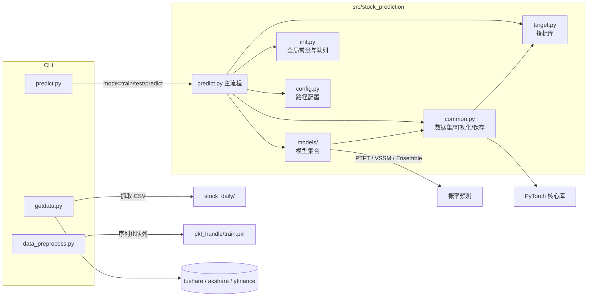

# 系统设计与架构总览

## 1. 总体架构
项目采用“命令行脚本 + 包内核心模块”的分层结构，整体数据流如下：

### 1.1 模块职责
| 模块 | 主要职责 | 备注 |
| ---- | -------- | ---- |
| `config.py` | 路径与目录管理 | 建议结合 `.env`/`pydantic` 做参数校验 |
| `init.py` | 超参数、设备、全局队列 | 仍以全局变量为主，后续可拆分 |
| `common.py` | 数据集、队列操作、绘图、模型保存 | 正在向“数据 / 模型 / 可视化”子模块拆分 |
| `models/` | 模型集合：LSTM、Transformer、TemporalHybridNet、ProbTFT、VSSM、PTFT_VSSM 等 | 新增模型请在此目录实现 |
| `predict.py` | CLI 主流程、训练/测试/预测 | 已支持 `main(argv=None)` 与 `create_predictor` |
| `getdata.py` | 行情采集脚本 | 仍需限速、重试机制 |
| `data_preprocess.py` | CSV 聚合与 `train.pkl` 序列化 | 对 Python 版本敏感，已提供兼容函数 |
| `target.py` | 技术指标函数库 | 可直接复用于特征工程 |
| `utils.py` | 文件、日志等通用工具 | 日志待结构化 |

### 1.2 近期改动摘要
- 升级 `GatedResidualNetwork` 支持上下文调制和门控残差，与原 TFT 更接近。
- 新增 ProbTemporalFusionTransformer（PTFT）与变分状态空间模型（V-SSM），并封装 PTFTVSSMEnsemble。
- `thread_save_model` 保存 state_dict（自动迁移到 CPU），避免 weight_norm 深拷贝问题。
- `predict.py` 支持 `--model ptft_vssm`，暴露 `create_predictor()` 方便测试和脚本复用。

## 2. 关键问题与改进方向
| 优先级 | 问题 | 建议方案 |
| ------ | ---- | -------- |
| 高 | CLI 模块仍耦合全局状态 | 引入 `Trainer`/`DataModule`，显式传递配置 |
| 高 | 数据缓存依赖 `queue.Queue` + `dill` | 迁移至 Arrow/Parquet，或增加版本头和升级脚本 |
| 高 | 行情采集缺少限速、重试 | 增加 retry/backoff、结构化日志与 `.env` 配置 |
| 中 | CPU 模式 AMP 警告 | 针对 CPU 完全禁用 AMP 或提供开关 |
| 中 | 文档更新易遗漏 | 在 PR 模板和 pre-commit 中加入文档校验 |
| 低 | BERT/NLP 代码仍在主包 | 拆分至独立模块或延迟加载 |

## 3. 模型演进
### 3.1 TemporalHybridNet
- 多尺度卷积 + Bi-GRU + Multi-Head Attention + 窗口统计特征。
- 适用于多尺度回归和长短期混合预测，CLI 参数：`--model hybrid`。

### 3.2 PTFT（ProbTemporalFusionTransformer）
- 包含变量选择、门控残差、多头注意力、分位输出。
- 通过 `quantiles` 参数输出 0.1/0.5/0.9 等分位值，支持概率预测。

### 3.3 V-SSM（Variational State Space Model）
- 双向编码器 + 时间依赖先验（GRUCell） + 观测/状态解读。
- 可输出隐藏状态、KL 项与 regime 概率，用于风险评估。

### 3.4 PTFT + V-SSM 双轨组合
- 在 `src/stock_prediction/models/ptft_vssm.py` 实现，融合 PTFT 与 V-SSM 预测，统一损失 `PTFTVSSMLoss`。
- CLI 参数：`--model ptft_vssm`，适用于对分位预测与状态概率都有需求的场景。

## 4. 路线图
| 阶段 | 目标 | 交付 |
| ---- | ---- | ---- |
| Phase 0 | 数据校验与配置梳理 | 特征字典、数据质量报告、统一配置文件 |
| Phase 1 | PTFT 实现与调参 | `models/ptft.py`、训练脚本、指标报告 |
| Phase 2 | V-SSM 实现 | `models/vssm.py`、状态分析报告 |
| Phase 3 | 组合与校准 | `models/ptft_vssm.py`、融合实验日志 |
| Phase 4 | 训练/推理自动化 | CLI/脚本完善、监控指标、容器化方案 |

## 5. 风险与缓解
| 风险 | 影响 | 缓解措施 |
| ---- | ---- | -------- |
| 训练数据不足或质量差 | 模型难以收敛 | Phase 0 加强数据校验，缺失数据回填或剔除 |
| 模型过拟合 | 泛化能力下降 | 交叉验证、正则化、早停、Dropout |
| 状态解释困难 | 难以给出策略建议 | 使用 SHAP/PCA、指标对比等后验解释工具 |
| 推理性能 | 延迟高、资源占用大 | 知识蒸馏、异步推理、轻量化版本 |
| 维护成本高 | 迭代效率低 | 标准化配置、统一训练管线、完善文档 |

## 6. 文档关联
- `docs/model_strategy.md`：模型策略设计详情与推荐组合。
- `docs/user_guide.md`：命令行使用、运维和多模型测试流程。
- `docs/maintenance.md`：关键修复、自动执行与后续建议。
- `CHANGELOG.md`：记录每次迭代的具体变更。

---
本文件旨在提供项目最新架构与演进背景，后续设计/实现/实验请持续同步至此文档，并与 `docs/model_strategy.md`、`docs/maintenance.md` 互相引用。 
