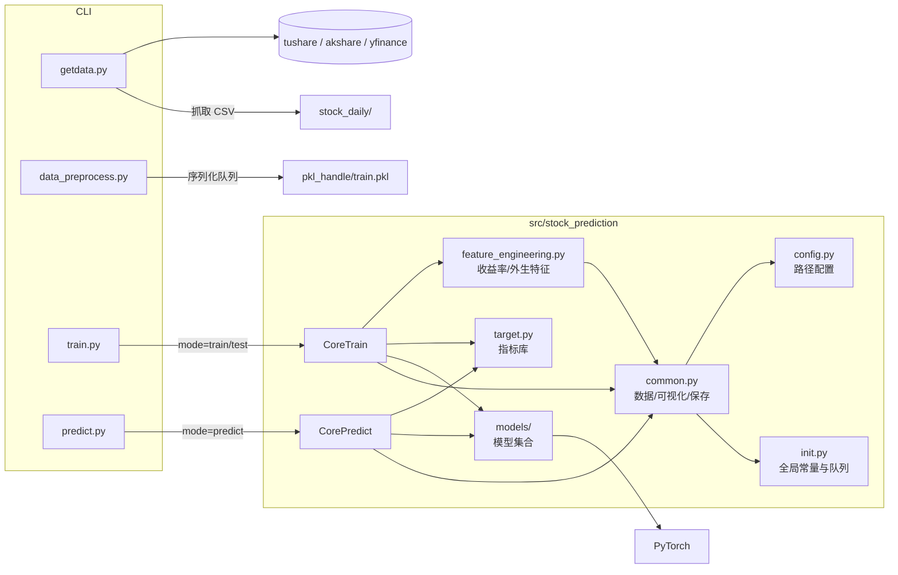

# 系统设计与架构总览

## 1. 总体架构
项目采用“命令行脚本 + 包内核心模块”的分层结构，数据流如下：

### 1.1 模块职责
| 模块 | 主要职责 | 备注 |
| ---- | -------- | ---- |
| `config.py` | 路径与目录管理 | 后续结合 `.env`/`pydantic` 做参数校验 |
| `init.py` | 超参数、设备、共享队列 | 正在拆分全局状态 |
| `common.py` | 数据集、队列工具、绘图、模型保存 | 计划拆分为数据/模型/可视化子模块 |
| `feature_engineering.py` | 收益率/差分建模、外生特征合并、滑动窗口统计 | 由 `AppConfig.features` 驱动，支持多股票联合、缺失值回填及 per-symbol 归一 |
| `models/` | 模型集合（LSTM、Transformer、TemporalHybridNet、ProbTFT、Diffusion、Graph 等） | 新模型在此注册 |
| `train.py` | 训练/测试 CLI 主流程 | `scripts/train.py` 提供命令行封装 |
| `predict.py` | 推理入口 | 暴露 `create_predictor()` 供外部复用 |
| `getdata.py` | 行情采集 | 后续增加限速、重试与日志 |
| `data_preprocess.py` | CSV 聚合为 `train.pkl` | 对 Python 版本敏感 |
| `target.py` | 技术指标库 | 可复用于特征工程 |
| `utils.py` | 文件、日志等通用工具 | 日志结构化仍在规划 |

### 1.2 近期改动
- 升级 GRN 与 VSSM 时间依赖先验，提升特征提取与状态建模能力。  
- 新增 ProbTemporalFusionTransformer、Variational SSM、PTFTVSSMEnsemble，并扩展 CLI。  
- 训练/推理流程拆分，推理支持多模型热插拔。  
- `thread_save_model` 仅保存 state_dict，解决 weight_norm 深拷贝阻塞。  
- 引入 `feature_engineering.py` 与 `FeatureSettings`，统一收益率建模、外生特征、滑动窗口配置。  
- 新增 DiffusionForecaster 与 GraphTemporalModel 原型，扩展多资产/情景分析能力。  

## 2. 关键问题与改进方向
| 优先级 | 问题 | 建议方案 |
| ------ | ---- | -------- |
| 高 | CLI 仍耦合全局状态 | 引入 `Trainer`/`DataModule`，显式传递配置 |
| 高 | 数据缓存依赖 `queue.Queue` + `dill` | 迁移至 Arrow/Parquet 或添加版本头与迁移脚本 |
| 高 | 行情采集缺少限速、重试 | 增加 retry/backoff、结构化日志与 `.env` 配置 |
| 中 | CPU 模式 AMP 警告 | 默认禁用 AMP 或提供开关 |
| 中 | 文档同步易遗漏 | 在 PR 模板与 pre-commit 中加入文档检查 |
| 中 | BERT/NLP 代码已从主包中拆分 | 已迁移至 `src/bert/`，根目录保留包装器以兼容旧入口；原始实现已备份到 `legacy_backup/bert/` |

## 3. 模型演进
### 3.1 TemporalHybridNet
多尺度卷积 + Bi-GRU + 多头注意力 + 窗口统计特征，适合多尺度回归与长短期混合预测，CLI 参数 `--model hybrid`。  

### 3.2 ProbTemporalFusionTransformer（PTFT）
具备变量选择网络、门控残差、多头注意力与分位输出，支持概率预测与解释分析。  

### 3.3 Variational State Space Model（V-SSM）
通过时间依赖先验和变分推断输出隐藏状态与 regime 概率，用于风险评估。  

### 3.4 PTFT + V-SSM 双轨组合
在 `models/ptft_vssm.py` 实现，融合分位预测与状态概率；`PTFTVSSMLoss` 叠加 KL 正则，推理通过 `--model ptft_vssm`。  

### 3.5 扩散与图模型（实验特性）
- **DiffusionForecaster**：模拟扩散噪声迭代的轻量化实现，强调情景生成与尾部风险度量，命令行使用 `--model diffusion`。  
- **GraphTemporalModel**：学习对称邻接矩阵以捕捉特征之间的关联，适用于多资产联合预测，命令行使用 `--model graph`。  
- 详细预研路线参见 `docs/research_diffusion_graph.md`。  
## 4. PTFT+VSSM 改进路线（依据 `docs/ptft_vssm_analysis_20251015.md`）
| 阶段 | 状态 | 开发重点 | 关键事项 | 产出 |
| ---- | ---- | -------- | -------- | ---- |
| Phase A | ✅ | 收益率建模 | 在数据预处理阶段生成对数收益率/差分序列；训练脚本增加目标选择 | 收益率数据管线、基准回测脚本 |
| Phase B | ✅ | Regime 自适应融合 | 设计 VSSM regime 驱动的动态加权，支持启发式与可学习门控；评估其对 RMSE/方向准确率影响 | 动态融合模块、验证报告 |
| Phase C | ✅ | 模型瘦身与正则 | 调整隐藏维度/层数，引入贝叶斯 Dropout、L2 正则；加入 regime 辅助分类损失 | 轻量化模型配置、过拟合评估 |
| Phase D | ✅ | 特征与数据扩充 | 引入宏观/行业/舆情特征，尝试多股票联合训练与滑动窗口集成策略 | 特征字典、联合训练实验日志 |
| Phase E | ✅ | 金融目标函数 | 在损失中加入方向性奖励、夏普/最大回撤代理，优化分位区间使用 | 金融指标对齐的训练方案、策略回测结果 |

> 各阶段执行情况需同步至 `docs/maintenance.md`，并在完成后迭代更新本路线图。  

## 5. 风险与缓解
| 风险 | 影响 | 缓解措施 |
| ---- | ---- | -------- |
| 数据质量不足 | 模型难以收敛 | Phase 0 加强校验，缺失值回填或剔除 |
| 模型过拟合 | 泛化能力下降 | 正则化、Dropout、交叉验证、早停 |
| 状态解释困难 | 策略落地受阻 | 使用 SHAP/PCA、指标对比，必要时加入监督信号 |
| 推理性能瓶颈 | 延迟高、资源占用大 | 知识蒸馏、异步推理、轻量化模型 |
| 维护成本高 | 迭代效率低 | 标准化配置、统一训练管线、完善文档 |

## 6. 文档关联
- `docs/model_strategy.md`：模型策略蓝图与改进计划（含 PTFT+VSSM 路线）。  
- `docs/ptft_vssm_analysis_20251015.md`：详细分析与改进建议来源。  
- `docs/maintenance.md`：结构演进与执行记录。  
- `docs/user_guide.md`：命令行/运维使用说明。  
- `CHANGELOG.md`：版本更新记录。  

---  
本文件记录系统架构与演进方向，需与上述文档保持联动更新。  

## 6. 股票 ID 嵌入数据流（新增 · 已完成 2025-10-17）
1. 特征工程在多股票场景下为每条记录生成 `_symbol_index`，并缓存 `symbol_index_map` 以便复用。
2. 数据集 `Stock_Data` 与 `stock_queue_dataset` 在构造批次时携带符号张量，Trainer/推理流程会自动传入模型。
3. TemporalHybridNet、PTFTVSSMEnsemble、DiffusionForecaster、GraphTemporalModel 在前向阶段通过 `nn.Embedding` 拼接股票向量，融合不同资产的上下文。
4. 通过配置 `features.use_symbol_embedding` / `symbol_embedding_dim` 控制嵌入开关，默认容量 4096（可通过环境变量 `SYMBOL_EMBED_MAX` 调整）。
- DiffusionForecaster 支持 `schedule`（linear/cosine）与上下文条件输入；GraphTemporalModel 支持动态邻接混合（`use_dynamic_adj` / `dynamic_alpha`）。
