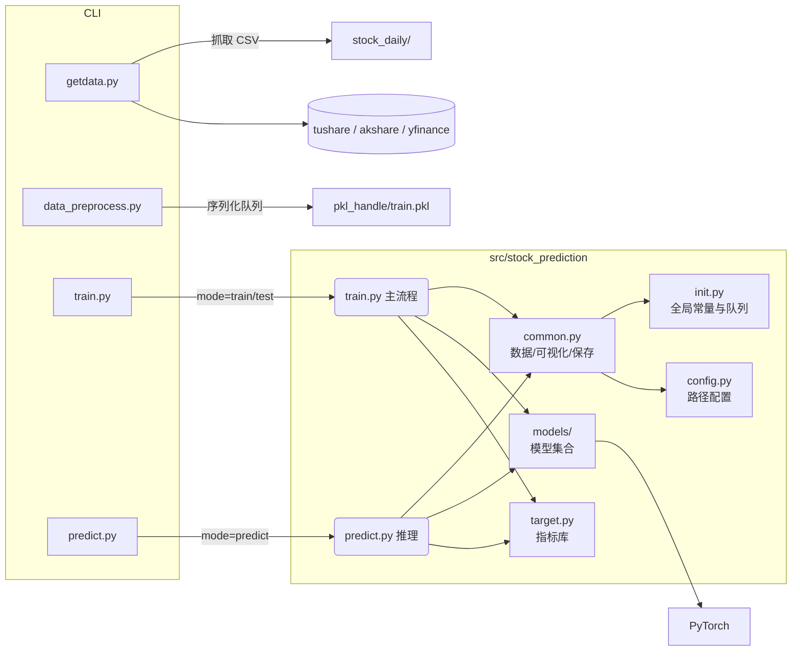

# 系统设计与架构总览

## 1. 总体架构
项目采用“命令行脚本 + 包内核心模块”的分层结构，整体数据流如下：

### 1.1 模块职责
| 模块 | 主要职责 | 备注 |
| ---- | -------- | ---- |
| `config.py` | 路径与目录管理 | 建议结合 `.env`/`pydantic` 做参数校验 |
| `init.py` | 超参数、设备、共享队列 | 当前仍以全局变量为主，后续可拆分 |
| `common.py` | 数据集、队列工具、绘图、模型保存 | 正在向“数据 / 模型 / 可视化”子模块拆分 |
| `models/` | 模型集合（LSTM、Transformer、TemporalHybridNet、ProbTFT、VSSM、PTFT_VSSM 等） | 新增模型请在此目录实现 |
| `train.py` | 训练/测试 CLI 主流程 | 新增 `scripts/train.py` 封装命令行调用 |
| `predict.py` | 推理入口，加载权重并输出预测 | 暴露 `create_predictor()` 供外部复用 |
| `getdata.py` | 行情采集脚本 | 仍需限速与重试机制 |
| `data_preprocess.py` | CSV 聚合为 `train.pkl` | 对 Python 版本敏感，已提供兼容函数 |
| `target.py` | 技术指标函数库 | 可直接复用于特征工程 |
| `utils.py` | 文件、日志等通用工具 | 日志结构化仍在计划中 |

### 1.2 近期改动
- 升级 `GatedResidualNetwork`（GRN）与 VSSM 时间依赖先验，提升特征提取与状态建模能力。
- 新增 ProbTemporalFusionTransformer（PTFT）、Variational SSM 及 PTFTVSSMEnsemble，推理侧增加 `--model ptft_vssm`。
- 将训练流程拆分至 `src/stock_prediction/train.py`，推理职责由 `predict.py` 独立承担。
- `thread_save_model` 改为保存 state_dict（自动迁移到 CPU），避免 weight_norm 深拷贝问题。

## 2. 关键问题与改进方向
| 优先级 | 问题 | 建议方案 |
| ------ | ---- | -------- |
| 高 | CLI 仍耦合全局状态 | 引入 `Trainer`/`DataModule`，显式传递配置 |
| 高 | 数据缓存依赖 `queue.Queue` + `dill` | 迁移到 Arrow/Parquet，或增加版本头与升级脚本 |
| 中 | 行情采集缺少限速、重试 | 增加 retry/backoff、结构化日志与 `.env` 配置 |
| 中 | CPU 模式 AMP 警告 | 针对 CPU 完全禁用 AMP 或提供开关 |
| 中 | 文档同步易遗漏 | 在 PR 模板与 pre-commit 中加入文档校验 |
| 低 | BERT/NLP 代码仍在主包 | 拆分到独立模块或延迟加载 |

## 3. 模型演进
### 3.1 TemporalHybridNet
多尺度卷积 + Bi-GRU + 多头注意力 + 窗口统计特征，适用于多尺度回归和长短期混合预测，CLI 参数：`--model hybrid`。

### 3.2 ProbTemporalFusionTransformer（PTFT）
包含变量选择网络、门控残差、多头注意力与分位输出，支持概率预测与解释分析。

### 3.3 Variational State Space Model（V-SSM）
使用双向编码器、时间依赖先验和变分推断输出隐藏状态与 regime 概率，用于风险评估。

### 3.4 PTFT + V-SSM 双轨组合
在 `models/ptft_vssm.py` 实现，用于融合分位预测和状态概率；训练时配合 `PTFTVSSMLoss`，推理通过 `predict.py --model ptft_vssm` 触发。

## 4. 路线图
| 阶段 | 目标 | 输出 |
| ---- | ---- | ---- |
| Phase 0 | 数据校验与配置梳理 | 特征字典、数据质量报告、统一配置文件 |
| Phase 1 | PTFT 实现与调参 | `models/ptft.py`、训练脚本、指标报告 |
| Phase 2 | V-SSM 实现 | `models/vssm.py`、状态分析报告 |
| Phase 3 | 组合与校准 | `models/ptft_vssm.py`、融合实验日志 |
| Phase 4 | 训练/推理自动化 | CLI/脚本完善、监控指标、容器化方案 |

## 5. 风险与缓解
| 风险 | 影响 | 缓解措施 |
| ---- | ---- | -------- |
| 数据质量不足 | 模型难以收敛 | Phase 0 加强校验，缺失值回填或剔除 |
| 模型过拟合 | 泛化能力下降 | 交叉验证、正则化、早停、Dropout |
| 状态解释困难 | 策略难以落地 | 使用 SHAP/PCA、指标对比等后验工具 |
| 推理性能瓶颈 | 延迟高、资源占用大 | 知识蒸馏、异步推理、轻量化版本 |
| 维护成本高 | 迭代效率低 | 标准化配置、统一训练管线、完善文档 |

## 6. 文档关联
- `docs/model_strategy.md`：模型策略设计与推荐组合
- `docs/user_guide.md`：命令行/运维使用说明
- `docs/maintenance.md`：结构调整、修复记录与改进建议
- `CHANGELOG.md`：记录各版本的变更

---
本文件旨在提供项目最新架构与演进背景，后续设计/实现/实验请及时同步至此文档，并与 `docs/model_strategy.md`、`docs/maintenance.md` 互相引用。
